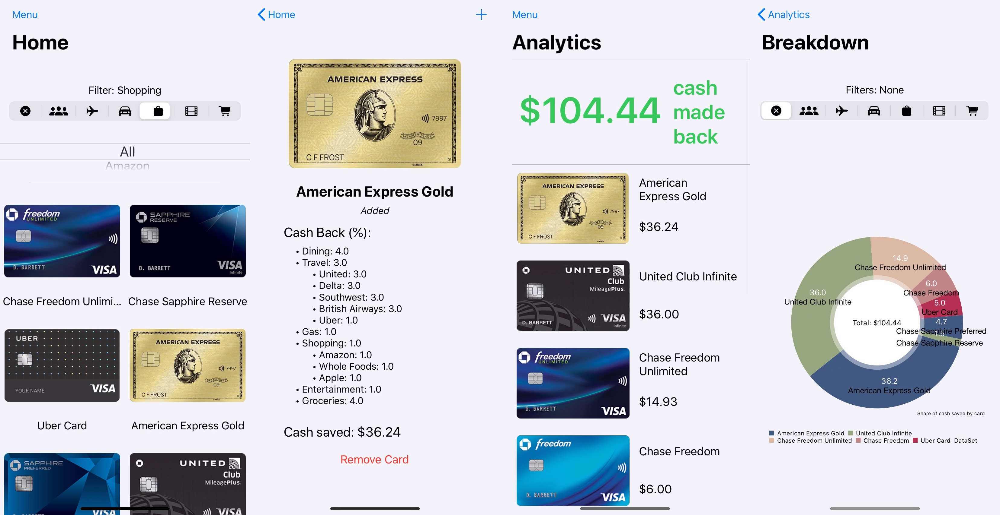

## Overview

As the final project for CIS 195 (iOS development), I built an app to help users manage their own credit cards as well as maximize savings by calculating the best card for a given purchase. Since each card has its own specific set of rewards/cash-back conditions, it can get difficult to keep track of each of them and manually calculate the "best" card. In fact, the "best" card will depend on what items you're buying. This app will keep track of that and do all the hard work for you. And who doesn't love saving money!

## Features

**Left to Right**: _(1)_ Home screen for determining the best card for a given purchase _(2)_ Cash back details for a selected card _(3)_ Analytics regarding total cash back and by card _(4)_ Advanced breakdown of credit cards filtered by purchase types
