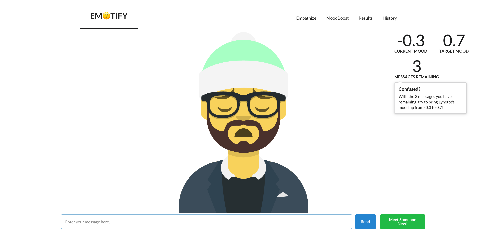

## Overview

Every September, Penn hosts an event called PennApps, the largest student-run college hackathon. Over the course of one weekend, students across the country gather to build a single project to tackle real-world problems. This year (2020), I worked with my roommate Luis, Albert, and Manny (two of his friends from University of Washington) to build a web app designed to help kids with Autism.

Children diagnosed with Autism generally have a more difficult time reading facial expressions and detecting sentiment. This can trickle down to not fully understanding other people's emotions during conversations. Furthermore, it can be difficult to give an objective way of interpreting people's emotions when receiving autism therapy to help with social interactions.

Emotify is an all-in-one resource for people with trouble recognizing and interpreting emotion. One of the features is a game where users attempt to boost the mood of others with a limited number of messages. Learning to speak on topic and stating your points concisely is a key skill, and one that we wanted to target. As such, each message sent is parsed using Google NLP, giving us a sentiment score from -1 to 1.

Additionally, we built results and history pages to allow users the chance to see their progress over time. We think it's especially motivating to see your own growth - and it's our hope that the users will too.

## Development Process

We set up a React front-end, splitting the different features of our web app into tabs for easy navigation. On the back-end, we ran our app on Google cloud and used their SQL database service as well as running a natural language processing API offered by Google Cloud Platform.

## Setbacks

We had envisioned a very different app on Friday, one build out of Unity where users could interact with a Sim like world. This way, users will have a more realistic, 3d feel for how to interact with others in a variety of situations. However, none of us were particularly familiar with Unity, so picking that up from scratch was difficult. In the end, we pivoted over to a web app, where we found much more success.

## Takeaways

We managed to successfully integrate Google's Natural Language Processing API to enable the analysis of our user input and expanding Emotify's functionality despite not having much experience with ML. We are proud of our clean front-end design and simple UI using React as well as being able to leverage tools such as avatar builders and a complex interaction with our back-end.

We worked through several communication issues and working as a team to be more efficient in the distribution of our tasks and leveraging our unique skills to maximize Emotify's functionality.

In the future, we would like to upgrade this project by transitioning it over to Unity. We still believe that the best way for people to practice interactions and reading facial expressions is through realistic scenarios. Looking ahead, we hope that this idea will benefit many people in world who struggle to pick up on social cues, idioms, and hidden text.

View our Devpost submission 
<a class="link" href="https://devpost.com/software/emotify-0rcyl4" target="_BLANK" rel="noopener noreferrer">here!</a>

