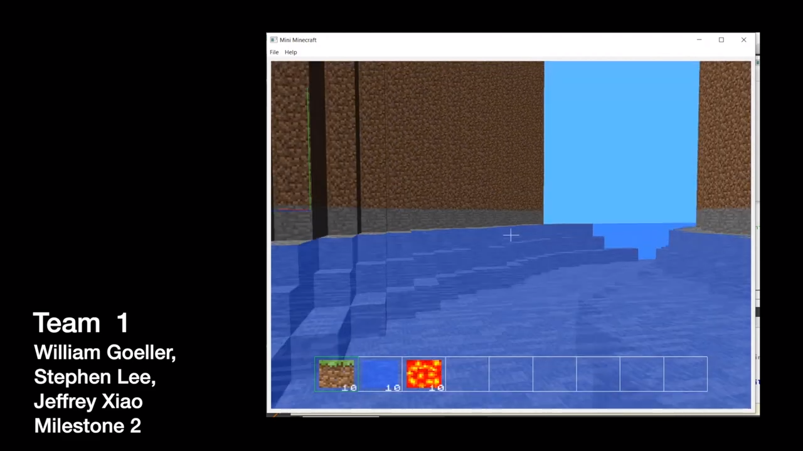

## Overview

As the final project for CIS 460 (Interactive Computer Graphics), my team and I were tasked with building a miniature (and simplified) version of Minecraft. Although the game seems simple in terms of graphics and pixels, rendering each of the components (not to mention combining them in an efficient manner) was no easy task. Through this project, we learned a lot about how OpenGL works and how real-Minecraft takes advantage of small details to greatly optimize the effiency and rendering of the game.

---

## Features Broken Down By Milestone

### Milestone 1

<a href="https://www.youtube.com/watch?v=SprDp1zjiAA" title="Milestone 1"></a>
<a class="link" href="https://www.youtube.com/watch?v=SprDp1zjiAA" title="Milestone 1">Link to Milestone 1 Video Here</a>

- **Procedurally Generated Terrain (rolling hills, mountain caps, etc.)**
  - Implemented by _William Goeller_
  - Procedural terrain was generated using Noise Functions.
  - Procedural terrain uses an array of numbers 0-255 placed in a random order.
  - It is essentially used as a seed for the terrain generation.
- **Efficient Terrain Rendering and Chunking**
  - Implemented by _Stephen Lee_
  - Efficient terrain rendering algorithm implemented by only considering VBO data
    for external faces
  - Shader program setup for interleaved VBO
  - Zone edge detection to create new zones before the player would enter them,
    and efficient rendering of only chunks close to the player
  - Most issues encountered related to setting up VBO data correctly to send to
    the shader and edge cases for rendering new zones and updating existing ones.
- **Game Engine and Player Physics**
  - Implemented by _Jeffrey Xiao_
  - Player physics were implemented by running a switch case over all key inputs
    and rotating the camera each time the mouse was moved. Cursor is centered in
    game window.
  - Terrain collision and adding/removing blocks used a grid marching algorithm to
    determine collisions in a specified ray direction.
  - Most of the time was spent debugging the terrain collision approach. Although
    the grid marching algorithm was implemented correctly, I was struggling
    balancing the offsets and signs of the ray directions.

---

### Milestone 2

<a href="https://youtu.be/FdqOyrEHh2A" title="Milestone 2"></a>
<a href="https://youtu.be/FdqOyrEHh2A" title="Milestone 2">Link to Milestone 2 Video Here</a>

- **L-System Rivers**
  - Implemented by _Stephen Lee_
  - Grammar system for recursively expanding river branches that get thinner with
    recursion depth
  - A set of general river segment shapes (straight, curve left, curve right,
    squiggle) for grammar segments randomly selected and generated
  - Post-process shading and player physics changes when in `LAVA` or `WATER`
    blocks
  - Generally runs pretty slowly, we've included macros in mygl.cpp to allow for
    river placement to be toggleable
- **Texturing and Texture Animation**
  - Implemented by _Jeffrey Xiao_
  - Texturing implemented by making use of a `sampler2D` within the fragment
    shader
  - Animation of `LAVA` and `WATER` blocks were implemented by transitioning
    between two blocks relative to `u_Time`
  - Opaque and transparent blocks were separated, each of whicch contained its own
    interleaved VBO data
  - Most issues were with texture rendering across chunks and back-face culling
    issues. This was resolved by reordering my vertices and drawing them in
    counter-clockwise order.
- **Multithreaded Terrain Generation**
  - Implemented by _William Goeller_
  - Uses the QThreadPool and QThread classes for multitreading.
  - Also uses the Mutex class in the C++ standard library to ensure no two threads
    edit the collection at the same time.

---

### Milestone 3

<a href="https://www.youtube.com/watch?v=GF05g4LuAxE" title="Milestone 3"></a>
<a href="https://www.youtube.com/watch?v=GF05g4LuAxE" title="Milestone 3">Link to Milestone 3 Video Here</a>

- **Caves**
  - Implemented by _Stephen Lee_
  - Two noise noise functions for generating Perlin noise for the roof and floor
    of the cave
  - Separate height fields used as basis for generating stalactites and
    stalagmites, and transformed to give the appearance of spires
  - Ore block texturing and placement throughout the cave system, so go find the
    cave for some diamonds :)
  - Most of my time was spent playing around with the noise functions to make my
    cave look realistic
- **Inventory and Onscreen GUI**
  - Implemented by _Jeffrey Xiao_
  - Inventory and GUI can be toggled on or off with the `I` key
  - Inventory is repeatedly updated when a block is added/removed from the
    inventory (broken/placed in the world)
  - Inventory displays values for count of each block
  - Note: number displayed handles 1 and 2 digit values
  - Most of the time was spent debugging the VBO's created and checking whether
    the correct information was passed to the shaders
- **Crafting System**

  - Implemented by _William Goeller_
  - Press the `i` key to open up the crafting screen.
  - Select a block from inventory using number keys
  - Select which slot in the crafting grid you want the block to go using the following keys in this grid layout:

    ```
    T  Y  U
    G  H  J
    B  N  M
    ```

  - To actually move the block into the crafting grid, press `p`.
  - To remove a block from the grid and put it back into the inventory, press `o`
    once you have hilighted which one you want removed.
  - Once you are done setting up the grid in the order that you like, press `c` to
    craft the block and it will be put into your inventory.
  - You can view the possible recipes in the constructor of `crafting.cpp`.
    The first 9 blocks represent the recipe as if the three rows were put into a
    1D array one after another. The last block represents what the recipe will
    create once crafted.

- **Sound**
  - Implemented by _Jeffrey Xiao_
  - Footsteps, background (Minecraft theme song), water, and lava sounds were
    added.
  - Note: because of the nature of the `QSound` and `QSoundEffect` libraries,
    there may be a slight delay in building the project and whenever the player
    breaks/places blocks.
