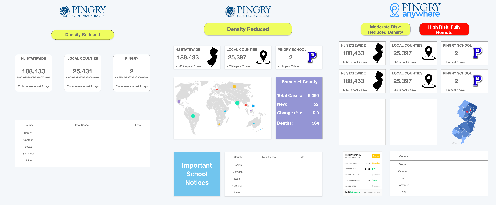
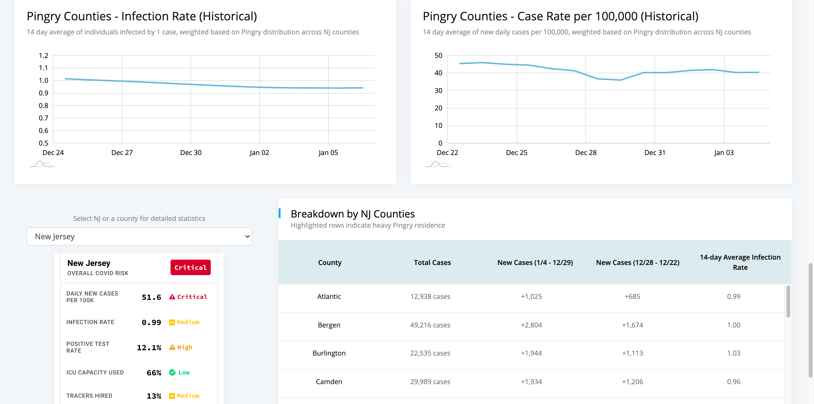
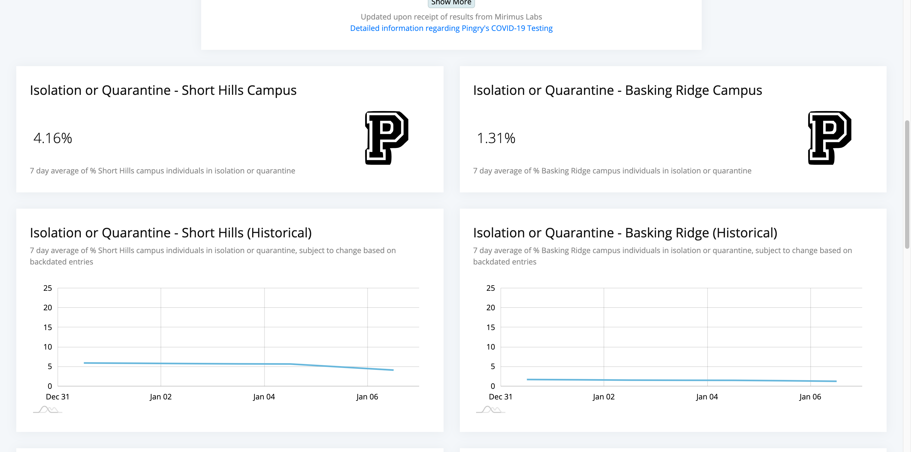

## Background

The year 2020 was like none other. As the world closed their borders and locked down, people were looking for ways to stay safe. And often times, step 1 to being safe is staying informed.

As the 2020-2021 academic year approached, Pingry (my high school) was brainstorming plans for safe return to school. After some discussion, it became apparent that a public dashboard to inform the community would be useful. To be as transparent as possible about the school's reopening decisions, the dashboard would display all statistics (stripped of name-sensitive material) used in the decision making process, including historical trends at the state, county, and internal levels.

This is where I came in. My friend Drew Beckmen was already helping to build an internal, back-end portal to compile and tab incoming data (i.e. new cases and contact tracing). As such, I helped to develop the front-end portion of this task - the product visible to the entire community.

---

## Development Process

These are the three designed wireframes (made using Adobe XD) - the leftmost being the earliest draft and the rightmost being the latest wireframe (although the current/final version is drastically different!)

Implementing the front-end styling and components was not easy or simple, but was overall the most straightforward portion. Since I chose to use React, things like state management, third-party packages, and component simplicity were all there.

The data for this dashboard is two fold.

1. External data

   - This includes data regarding cases and infection rates at the state and county levels.
   - 
This was relatively simple to fetch. A simple axios command calling
 
<a class="link" href="https://www.covidactnow.org/?s=1490446">CovidActNow.org</a>

's API got the job done.

2. Internal data

   - This includes data regarding cases within the Pingry School community
   - There are two public endpoints from the back-end database, so these were called to refresh and update the data every morning.

Because daily numbers may fluctuate and therefore may not be the best sole indicator, we wanted to present historical (7-day / 14-day) averages. This meant that each day, my server-side code would have to modify the public database by pushing the newest day's numbers, popping oldest day's numbers, and then recalculate the sliding window averages.

The final project is deployed using Heroku.

---

## Setbacks

Perhaps the biggest setback was the reliability and communication. Because families used this dashboard to make daily decisions about whether their children should attend classes remotely or in-person, it was important to ensure that the data was accurate.

Shortly after the dashboard was made public, we found a logical flaw in the way we presented the historical graphs. Because test results aren't immediate, any positive test result would be entered a day or two after the date of test administration. As a result, there becomes an inconsistency in the historical data (at the time, we were manually tracking these and found impossible numbers to satisfy the dashboard). Thankfully, this bug was found relatively early on and (more importantly) was fixed immediately. Still, finding this bug shortly after the dashboard had been released was nerve-wracking, to say the least.

---

## Takeaways

I'm very proud of this project. It was my first full fledged full-stack application, and I spent a lot of time planning, developing, and maintaining it. It certainly taught me a lot about the development/production process, especially on how to bounce back from and respond to changes.

I owe a lot of credit to my friend
 
<a class="link" href="https://www.linkedin.com/in/drew-beckmen/">Drew Beckmen</a></a>
 
for introducing me to and working with me on this project as well as the entire Pingry COVID task-force. Without them, none of this would be possible, and the school may not even have a public dashboard!

Check out The Pingry School's article on both this and Drew's project 
<a class="link" href="https://www.pingry.org/hp/news-page/news-pop-up-page/~post/young-alumni-launch-pingrys-cutting-edge-covid-19-dashboard-20201116" target="_BLANK" rel="noopener noreferrer">here!</a>

